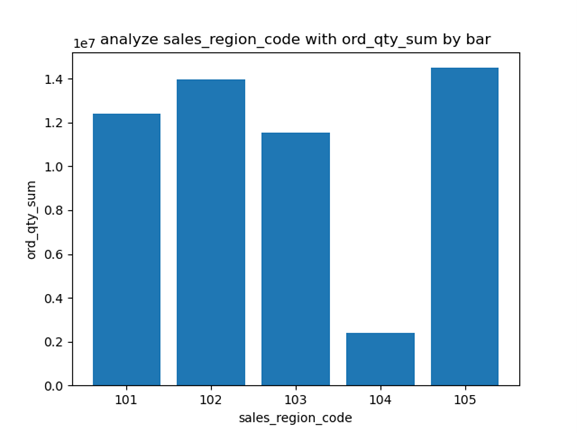
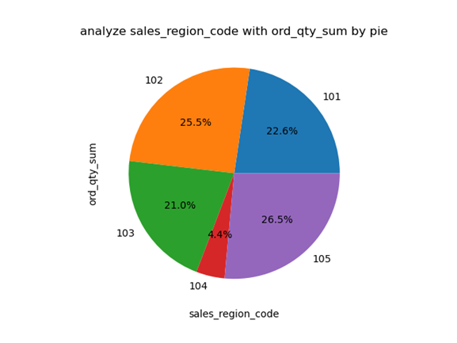
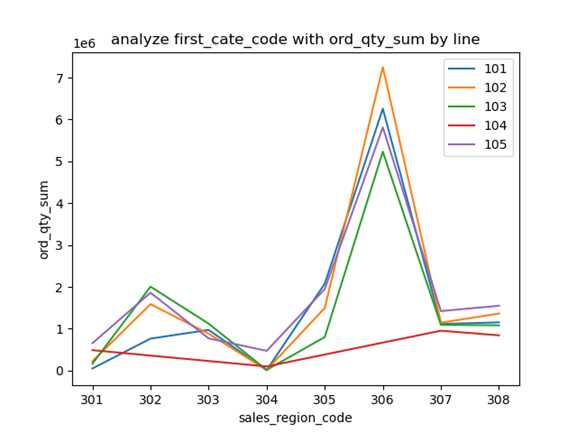
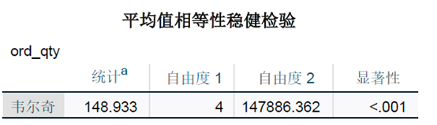

首先进行数据可视化，图1为各个地区销售订单量柱状图，图2为各个地区销售订单；量饼状图，图3为每个地区不同产品大类订单量折线图。从图1和图2中我们可以发现地区编码为105和102的地区订单量较多，而地区编码为104的地区是五个地区中订单量最少的，并且占比为4.4%。从图3中我们可以地区编码为104 的地区缺少对产品大类302、303、305、306的订单量数据，其他地区编码区域正常，并且发现对于所有地区，产品大类为304的产品需求量都是最低的，产品大类为306的产品需求量都是最高的。

​                               

其次进行单因素素方差分析方法定量分析不同区域对于需求量是否存在显著差距。我们借助SPSS数据分析软件对产品区域编码和订单量进行单因素方差分析，首先使用莱文检测检验方差齐性，从下图可以发现显著性<.001，方差齐性检验出现显著性，说明不同组别的数据波动不一致，方差不齐，可以使用Welch anova方法进行分析。

假设H0是不同区域对于需求量存在显著差异，那么H1是不同区域对于需求量没有显著差异。Welch anova方法分析后的结果如下图所示，通过结果可以分析其显著性<0.001，故拒绝H0，接受H1，认为不同地区之间的订单量之间具有极显著统计学105和差异。

最后进行多重比较，通过上文分析可知数据方差不齐，因此我们使用Games-Howell方法进行多重比较，得到下图所示结果，我们可以通过显著性分析得知，地区编码101和102、105之间有极显著统计学差异，地区编码102和101、103、104之间有极显著统计学差异，地区编码103和102、105之间有极显著统计学差异，地区编码104和102、105之间有极显著统计学差异，地区编码105和101、103、104之间有极显著统计学差异。简而言之，地区编码为102、105的地区订单数据相似，地区编码为101、103、104的地区订单数据相似。

