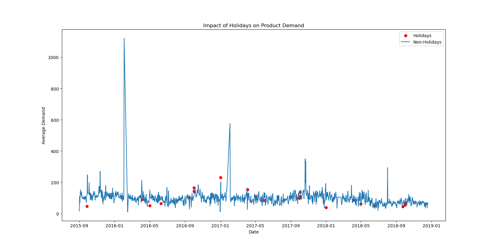
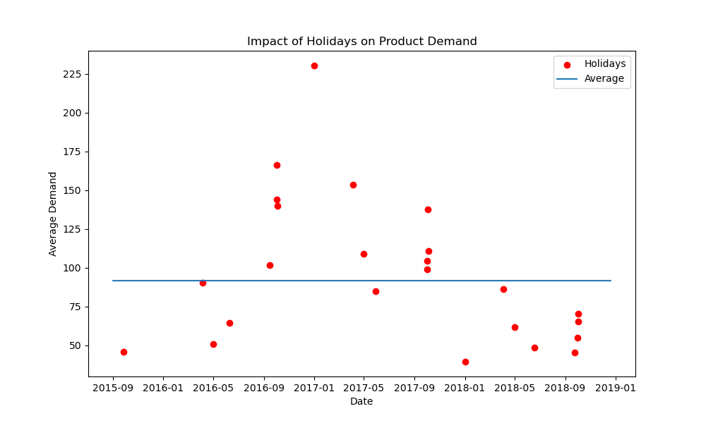
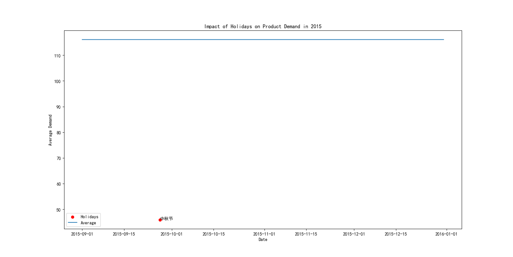
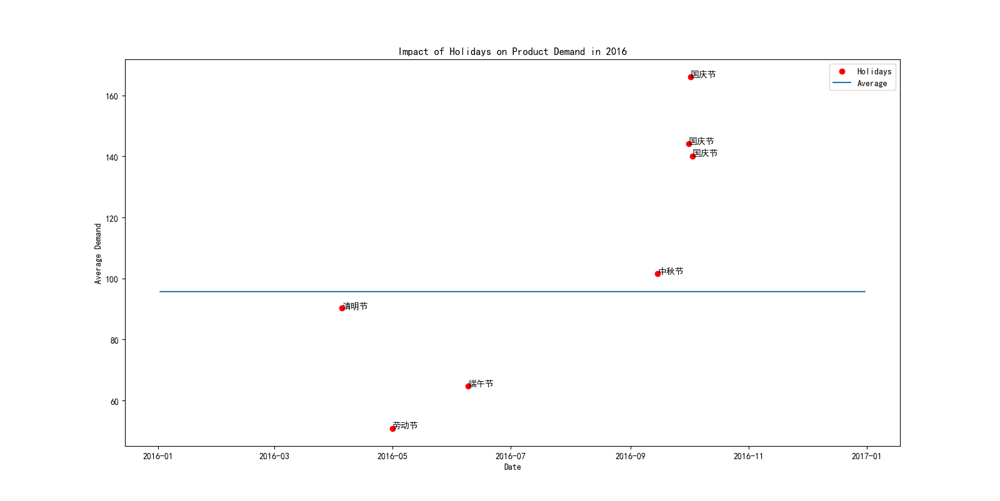
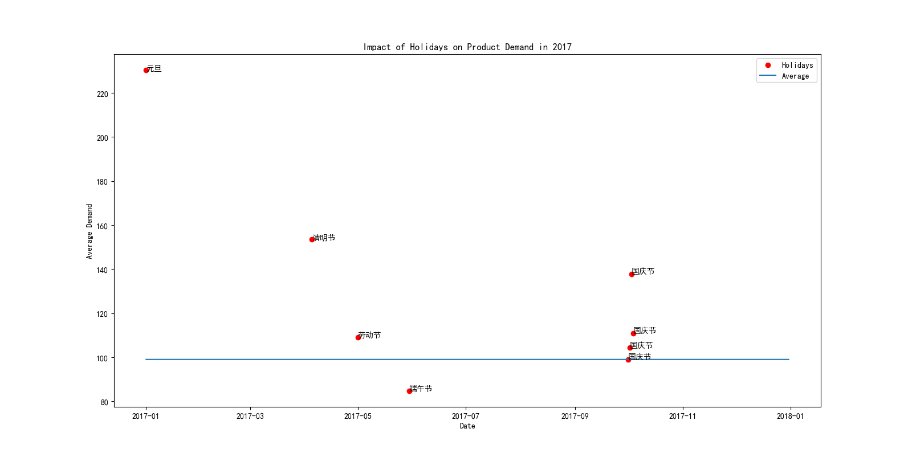
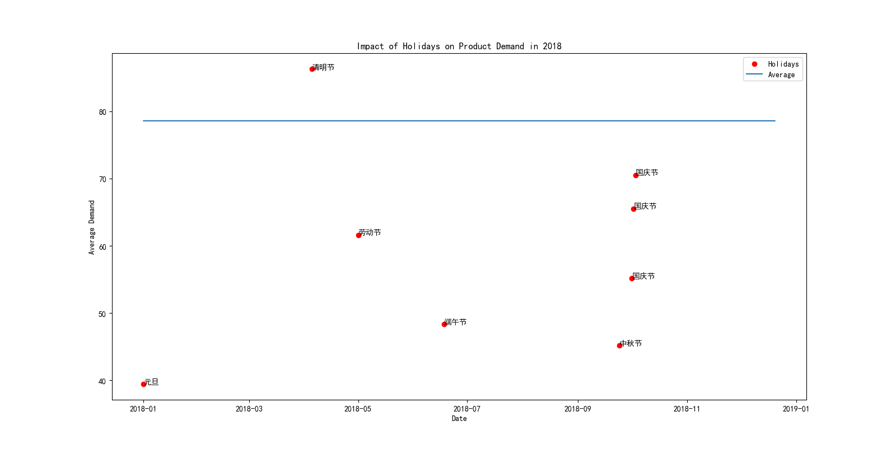

我们要探究节假日对产品需求量的影响，首先对比非节假日产品订单需求量与节假日产品订单需求量的相对关系，图1为2015年-2018年四年内非节假日产品需求量折线图与节假日产品需求量散点图。从图中我们可以发现代表着节假日产品需求量的红色散点大部分没有明显高于或者低于附近的非节假日产品需求量折线，初步说明节假日对产品需求量没有特殊影响。

为了进一步分析节假日是否对产品需求量产生相应影响，图2为2015年-2018年内节假日产品需求散点图，图中的蓝色水平线代表2015年-2018年的天平均产品需求量。从图中我们可以发现高于天平均产品需求量的节假日与低于天平均产品需求量的节假日在分布上大致相同，说明节假日对产品订单需求量没有特殊影响。

为了具体分析节假日种类（如元旦节、清明节、劳动节、国庆节等）对产品平均订单需求量的影响，我们绘制了图3到图5共四张散点图，分别对应了2015年节假日产品需求量散点图、2016年节假日产品需求量散点图、2017年节假日产品需求量散点图和2018年节假日产品需求量散点图，四张散点图中蓝色的水平线分别代表2015年天平均产品需求量、2016年天平均产品需求量、2017年天平均产品需求量和2018年天平均产品需求量。我们只考虑题目数据中存在的节假日数据，发现在4年时间内，除了端午节在每年的产品需求量低于当年的天平均产品需求量以外，元旦节、清明节、劳动节、中秋节和国庆节均有高于或低于当年的天平均产品需求量分布。因此我们可以认为在现有题目数据存在的有效节假日种类中，只有端午节会对产品需求量产生影响，并且端午节会降低产品的需求量。

