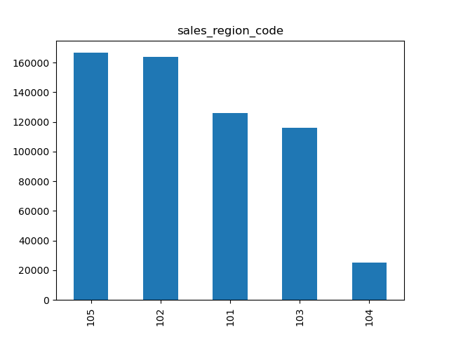
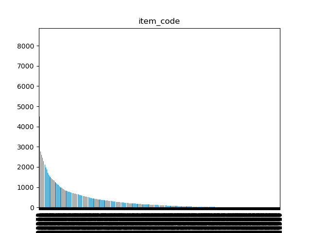
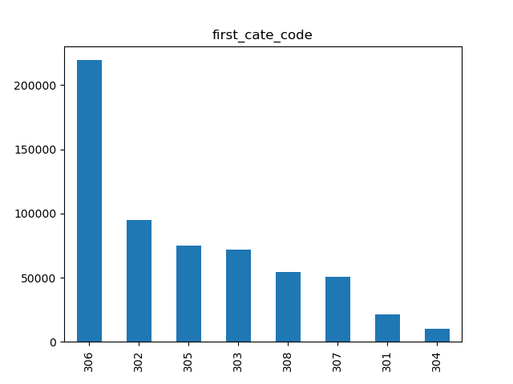
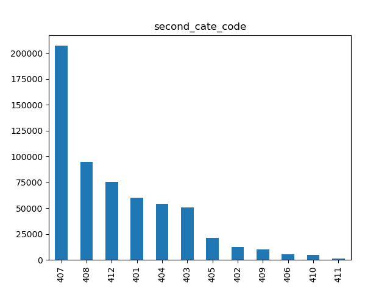
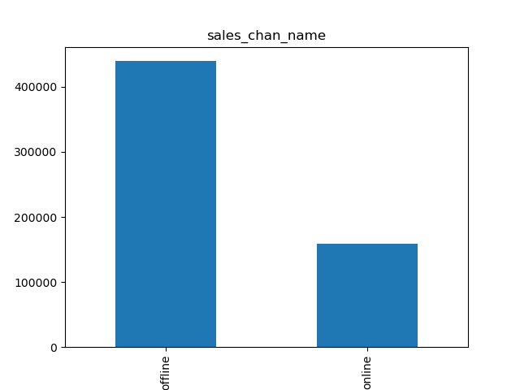
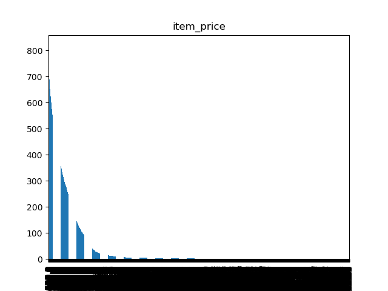
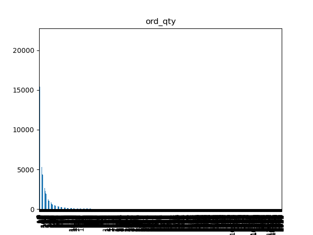

# 提交要求
## 论文
论文需要有题目、中文摘要、关键词和目录，目录页之后开始正文，请从正文开始编写页码。摘要不必翻译成英文。

## 论文写作结构（参考）

摘要

问题的重述

问题的分析

模型的设计与建模方法的选择

模型的表达与论述

文献的引用与标注

## Result 1. Xlsx
预测结果

## 程序. Zip
模型和代码

## 竞赛承诺书

# 数据

> 包含8项

| 订单日期       | 销售区域编码      | 产品编码  | 产品大类编码         | 产品细类编码     | 销售渠道名称        | 物品单价   | 订单数量 |
| -------------- | ----------------- | --------- | -------------------- | ---------------- | ------------------- | ---------- | -------- |
| order_date     | sales_region_code | item_code | first_cate_code      | second_cate_code | sales_chan_name     | item_price | ord_qty  |
| 2015.9-2018.12 |                   |           | 一个大类对应多个细类 |                  | 分为 online/offline |            |          |
|                |                   |           |                      |                  |                     |            |          |

销售区域+产品编码确定一个物品
如果不存在销售记录，或销售记录很少，就得依靠产品大类和细类编码进行预测

## 订单日期 order_date

## 销售区域编码 sales_region_code

> 总共有五个区域，应该是对应，华东/西/南/北/中

## 产品编码 item_code

> 总计有1758 项，最高出现8000 次，最低出现 1 次
> 

## 产品大类编码 first_cate_code

> 总共8大类

## 产品细类编码 second_cate_code

> 总共12细类

## 销售渠道 sales_chan_name 

> 销售渠道有两种，主要线下比较多

## 物品单价     item_price 

> 几百到几千都有

## 订单数量  ord_qty

> 订单数量从个位数到几千都有

# 数据分析

## 产品的不同价格对需求量的影响；

### 分析单个商品价格和需求量关系
对于这 1750 种产品来说，有的商品有 400 多种价格，有的商品只有一种价格，所以需要分析价格多样的商品

筛选出价格数量在 100 以上的商品 

选择一种数量最多的商品

## 产品所在区域对需求量的影响，以及不同区域的产品需求量有何特性；
## 不同销售方式（线上和线下）的产品需求量的特性；
## 不同品类之间的产品需求量有何不同点和共同点；
## 不同时间段（例如月头、月中、月末等）产品需求量有何特性；
## 节假日对产品需求量的影响；
## 促销（如618、双十一等）对产品需求量的影响；
## 季节因素对产品需求量的影响。

# 需求预测

> 预测未来3月（即2019年1月、2月、3月）的月需求量
>
> 请分别按天、周、月的时间粒度进行预测，试分析不同的预测粒度对预测精度会产生什么样的影响

## 预测数据

| 销售区域           | 产品编码  | 产品大类编码     | 产品细类编码      |
| ------------------ | --------- | ---------------- | ----------------- |
| sales_region _code | item_code | first_ cate_code | second_ cate_code |
|                    |           |                  |                   |
|                    |           |                  |                   |

