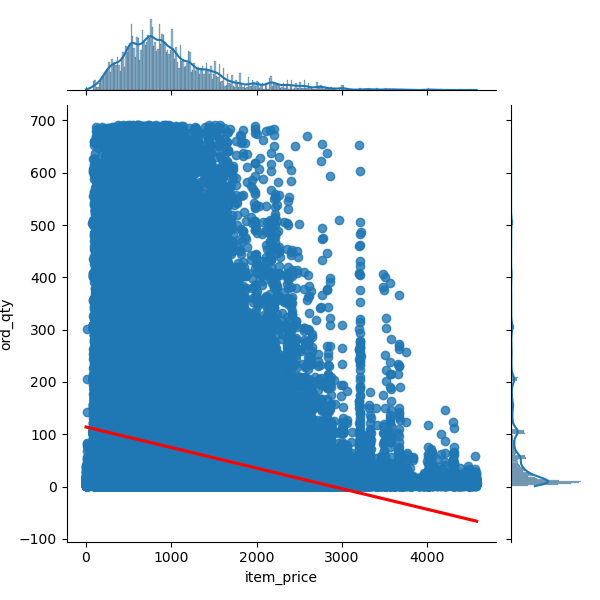

# 分析单个商品价格和需求量关系
对于这 1750 种产品来说，有的商品有 400 多种价格，有的商品只有一种价格，所以需要分析价格多样的商品

筛选出价格数量在 100 以上的商品 

选择一种数量最多的商品
发现，商品的数量在一个区间的时候是比较多的，价格过高或高低销量都很低

选择多种商品绘制分布
每个商品的价格，需求分布不同，简单来说, 就是每个商品的价格-需求分布不同。但每个商品来说都是相关的

# 总体分析价格和需求关系

计算两者相关性

可见两者有0.24的负相关性，也就是说随着价格的升高，需求量在逐渐减少

双变量分析

## 拟合直线

## 绘制结果

