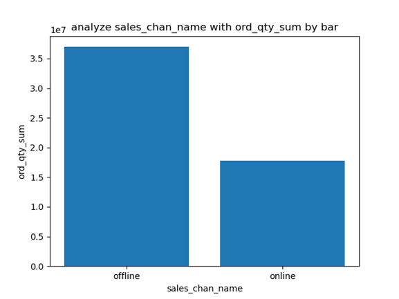
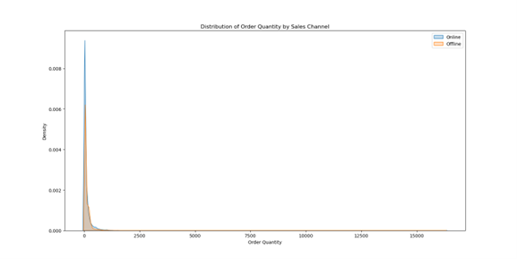

首先分析所有产品销售订单量与销售渠道的关系。图1是不同销售渠道下订单量的柱状图，图2是不同销售渠道下产品订单量分布的核密度图。

从图1中可以发现，对于全部产品，线下渠道的销售订单量整体偏高，而线上产品的销售订单量整体偏低，并且通过计算可知线下渠道的销售订单量是线上渠道销售订单量的2.07倍。简而言之，对于所有的产品销售订单量，相比与线上的销售渠道，其在线下的销售渠道具有更高的订单需求量。

​                               

从图2中可以看出，线上销售方式和线下销售方式都呈现处一个明显的峰值，但是线上产品订单量分布相对于线下产品订单量分布更加集中。

 

其次再从产品大类入手，图3是不同产品大类在不同销售渠道下的产品订单量柱状图，我们可以从图3中发现对于不同大类的产品，除了产品大类编号为301的产品线上的销售订单量大于线下，其余所有大类的产品线下销售订单量均大于线上订单销售量。

